# Import libraries


```python
%matplotlib inline
import pandas as pd
import csv
import re
import numpy as np
from datetime import datetime
import matplotlib.pyplot as plt
import seaborn as sns
```

# Data dictionary

* Date - Date of the crash

* Time - Time of the crash

* Location - Location of the crash
 
* Operator - Airline of the plane

* Route - Route taken by plane

* Type - Type of the plane

* Aboard - Number of people aboard

* Fatalities - Number of lethal outcomes

* Ground - Total people killed due to crash on the ground (for example, those who were not on board, but died due to the crash)

* Summary - Brief summary of the case

# Data preparation


```python
data = pd.read_csv('Airplane_Crashes_and_Fatalities_Since_1908.csv')
```


```python
data.drop(['Flight #', 'Registration', 'cn/In'], axis=1, inplace=True)
```


```python
times = []
for i in range(data.shape[0]):
    try:
        times.append(int(data['Time'][i][0:2]))
    except:
        continue

data_hours = pd.DataFrame()
data_hours['Time'] = pd.Series(times)
data['Time'] = data_hours['Time']
```


```python
def drop_missing_data_rows(data: pd.DataFrame):
    missing_data_rows = pd.isna(data["Date"])
    return data.drop(data[missing_data_rows].index, axis=0)
```


```python
def convert_float_to_int (data: pd.DataFrame):
    columns = data.select_dtypes(include=['float64']).columns
    data[columns] = data[columns].apply(pd.to_numeric, downcast='integer', errors='coerce')
    return data
```


```python
data = drop_missing_data_rows(data)
data = convert_float_to_int(data)
```


```python
data['Location'].fillna("Unknown", inplace=True)
data['Operator'].fillna("Unknown", inplace=True)
data['Route'].fillna("Unknown", inplace=True)
data['Type'].fillna("Unknown", inplace=True)
data['Summary'].fillna("Unknown", inplace=True)
```


```python
data['Date'] = pd.to_datetime(data['Date'])
data['Date'] = pd.DatetimeIndex(data['Date'])
date_index = data.set_index('Date')
```


```python
data['Date'].value_counts().sum()
```


    5268


```python
data.info()
```

    <class 'pandas.core.frame.DataFrame'>
    Int64Index: 5268 entries, 0 to 5267
    Data columns (total 10 columns):
     #   Column      Non-Null Count  Dtype         
    ---  ------      --------------  -----         
     0   Date        5268 non-null   datetime64[ns]
     1   Time        3035 non-null   float64       
     2   Location    5268 non-null   object        
     3   Operator    5268 non-null   object        
     4   Route       5268 non-null   object        
     5   Type        5268 non-null   object        
     6   Aboard      5246 non-null   float64       
     7   Fatalities  5256 non-null   float64       
     8   Ground      5246 non-null   float64       
     9   Summary     5268 non-null   object        
    dtypes: datetime64[ns](1), float64(4), object(5)
    memory usage: 452.7+ KB


```python
data.describe()
```


<div>
<style scoped>
    .dataframe tbody tr th:only-of-type {
        vertical-align: middle;
    }

    .dataframe tbody tr th {
        vertical-align: top;
    }

    .dataframe thead th {
        text-align: right;
    }
</style>
<table border="1" class="dataframe">
  <thead>
    <tr style="text-align: right;">
      <th></th>
      <th>Time</th>
      <th>Aboard</th>
      <th>Fatalities</th>
      <th>Ground</th>
    </tr>
  </thead>
  <tbody>
    <tr>
      <th>count</th>
      <td>3035.000000</td>
      <td>5246.000000</td>
      <td>5256.000000</td>
      <td>5246.000000</td>
    </tr>
    <tr>
      <th>mean</th>
      <td>12.869522</td>
      <td>27.554518</td>
      <td>20.068303</td>
      <td>1.608845</td>
    </tr>
    <tr>
      <th>std</th>
      <td>6.018657</td>
      <td>43.076711</td>
      <td>33.199952</td>
      <td>53.987827</td>
    </tr>
    <tr>
      <th>min</th>
      <td>0.000000</td>
      <td>0.000000</td>
      <td>0.000000</td>
      <td>0.000000</td>
    </tr>
    <tr>
      <th>25%</th>
      <td>9.000000</td>
      <td>5.000000</td>
      <td>3.000000</td>
      <td>0.000000</td>
    </tr>
    <tr>
      <th>50%</th>
      <td>13.000000</td>
      <td>13.000000</td>
      <td>9.000000</td>
      <td>0.000000</td>
    </tr>
    <tr>
      <th>75%</th>
      <td>18.000000</td>
      <td>30.000000</td>
      <td>23.000000</td>
      <td>0.000000</td>
    </tr>
    <tr>
      <th>max</th>
      <td>23.000000</td>
      <td>644.000000</td>
      <td>583.000000</td>
      <td>2750.000000</td>
    </tr>
  </tbody>
</table>
</div>


```python
data.shape
```


    (5268, 10)


```python
data.isnull().sum()
```


    Date             0
    Time          2233
    Location         0
    Operator         0
    Route            0
    Type             0
    Aboard          22
    Fatalities      12
    Ground          22
    Summary          0
    dtype: int64


```python
data.head()
```


<div>
<style scoped>
    .dataframe tbody tr th:only-of-type {
        vertical-align: middle;
    }

    .dataframe tbody tr th {
        vertical-align: top;
    }

    .dataframe thead th {
        text-align: right;
    }
</style>
<table border="1" class="dataframe">
  <thead>
    <tr style="text-align: right;">
      <th></th>
      <th>Date</th>
      <th>Time</th>
      <th>Location</th>
      <th>Operator</th>
      <th>Route</th>
      <th>Type</th>
      <th>Aboard</th>
      <th>Fatalities</th>
      <th>Ground</th>
      <th>Summary</th>
    </tr>
  </thead>
  <tbody>
    <tr>
      <th>0</th>
      <td>1908-09-17</td>
      <td>17.0</td>
      <td>Fort Myer, Virginia</td>
      <td>Military - U.S. Army</td>
      <td>Demonstration</td>
      <td>Wright Flyer III</td>
      <td>2.0</td>
      <td>1.0</td>
      <td>0.0</td>
      <td>During a demonstration flight, a U.S. Army fly...</td>
    </tr>
    <tr>
      <th>1</th>
      <td>1912-07-12</td>
      <td>6.0</td>
      <td>AtlantiCity, New Jersey</td>
      <td>Military - U.S. Navy</td>
      <td>Test flight</td>
      <td>Dirigible</td>
      <td>5.0</td>
      <td>5.0</td>
      <td>0.0</td>
      <td>First U.S. dirigible Akron exploded just offsh...</td>
    </tr>
    <tr>
      <th>2</th>
      <td>1913-08-06</td>
      <td>18.0</td>
      <td>Victoria, British Columbia, Canada</td>
      <td>Private</td>
      <td>Unknown</td>
      <td>Curtiss seaplane</td>
      <td>1.0</td>
      <td>1.0</td>
      <td>0.0</td>
      <td>The first fatal airplane accident in Canada oc...</td>
    </tr>
    <tr>
      <th>3</th>
      <td>1913-09-09</td>
      <td>10.0</td>
      <td>Over the North Sea</td>
      <td>Military - German Navy</td>
      <td>Unknown</td>
      <td>Zeppelin L-1 (airship)</td>
      <td>20.0</td>
      <td>14.0</td>
      <td>0.0</td>
      <td>The airship flew into a thunderstorm and encou...</td>
    </tr>
    <tr>
      <th>4</th>
      <td>1913-10-17</td>
      <td>1.0</td>
      <td>Near Johannisthal, Germany</td>
      <td>Military - German Navy</td>
      <td>Unknown</td>
      <td>Zeppelin L-2 (airship)</td>
      <td>30.0</td>
      <td>30.0</td>
      <td>0.0</td>
      <td>Hydrogen gas which was being vented was sucked...</td>
    </tr>
  </tbody>
</table>
</div>


```python
data.tail()
```


<div>
<style scoped>
    .dataframe tbody tr th:only-of-type {
        vertical-align: middle;
    }

    .dataframe tbody tr th {
        vertical-align: top;
    }

    .dataframe thead th {
        text-align: right;
    }
</style>
<table border="1" class="dataframe">
  <thead>
    <tr style="text-align: right;">
      <th></th>
      <th>Date</th>
      <th>Time</th>
      <th>Location</th>
      <th>Operator</th>
      <th>Route</th>
      <th>Type</th>
      <th>Aboard</th>
      <th>Fatalities</th>
      <th>Ground</th>
      <th>Summary</th>
    </tr>
  </thead>
  <tbody>
    <tr>
      <th>5263</th>
      <td>2009-05-20</td>
      <td>NaN</td>
      <td>Near Madiun, Indonesia</td>
      <td>Military - Indonesian Air Force</td>
      <td>Jakarta - Maduin</td>
      <td>Lockheed C-130 Hercules</td>
      <td>112.0</td>
      <td>98.0</td>
      <td>2.0</td>
      <td>While on approach, the military transport cras...</td>
    </tr>
    <tr>
      <th>5264</th>
      <td>2009-05-26</td>
      <td>NaN</td>
      <td>Near Isiro, DemocratiRepubliCongo</td>
      <td>Service Air</td>
      <td>Goma - Isiro</td>
      <td>Antonov An-26</td>
      <td>4.0</td>
      <td>4.0</td>
      <td>NaN</td>
      <td>The cargo plane crashed while on approach to I...</td>
    </tr>
    <tr>
      <th>5265</th>
      <td>2009-06-01</td>
      <td>NaN</td>
      <td>AtlantiOcean, 570 miles northeast of Natal, Br...</td>
      <td>Air France</td>
      <td>Rio de Janeiro - Paris</td>
      <td>Airbus A330-203</td>
      <td>228.0</td>
      <td>228.0</td>
      <td>0.0</td>
      <td>The Airbus went missing over the AtlantiOcean ...</td>
    </tr>
    <tr>
      <th>5266</th>
      <td>2009-06-07</td>
      <td>NaN</td>
      <td>Near Port Hope Simpson, Newfoundland, Canada</td>
      <td>Strait Air</td>
      <td>Lourdes de BlanSablon - Port Hope Simpson</td>
      <td>Britten-Norman BN-2A-27 Islander</td>
      <td>1.0</td>
      <td>1.0</td>
      <td>0.0</td>
      <td>The air ambulance crashed into hills while att...</td>
    </tr>
    <tr>
      <th>5267</th>
      <td>2009-06-08</td>
      <td>NaN</td>
      <td>State of Arunachal Pradesh, India</td>
      <td>Military - Indian Air Force</td>
      <td>Mechuka for Jorhat</td>
      <td>Antonov An-32</td>
      <td>13.0</td>
      <td>13.0</td>
      <td>0.0</td>
      <td>The military transport went missing while en r...</td>
    </tr>
  </tbody>
</table>
</div>


# Data analysis and visualization

## Count of crashes by Decade


```python
date_index.resample('10y').size().plot(figsize=[12, 6],
title='Count of crashes by Decade', marker=".")
```


    <matplotlib.axes._subplots.AxesSubplot at 0x7fea99209490>


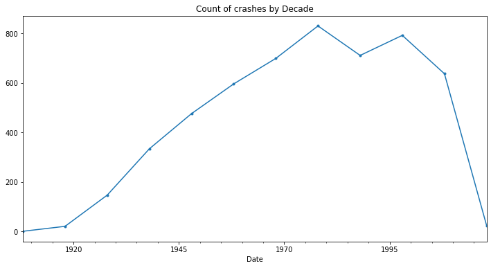


## Count of crashes by Year


```python
crashes_by_year = date_index.resample('1y').size().rolling(3).mean().fillna(0)
crashes_by_year.plot(figsize=[12, 6], title='Count of crashes by Year', marker=".")
```


    <matplotlib.axes._subplots.AxesSubplot at 0x7fea98976850>


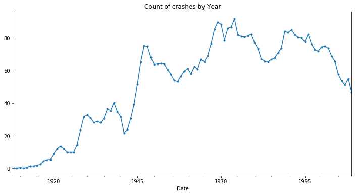


## Count of crashes by Day of Week


```python
date_day = pd.DataFrame()
date_day = pd.Series(data['Date']).dt.day_name()
date_day.value_counts().plot(kind='barh', figsize=[12, 6], title='Count of crashes by Day of Week')
```


    <matplotlib.axes._subplots.AxesSubplot at 0x7fea9882d490>


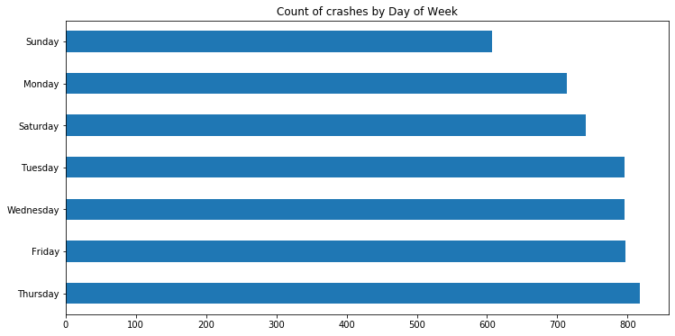


## Count of crashes by Month


```python
date_month = pd.DataFrame()
date_month.index.name = 'index'
date_month['Month'] = pd.Series(data['Date'])
date_month['Month'] = date_month['Month'].dt.month_name()
date_month['Month'].value_counts().plot(kind='barh',figsize=[12, 6], title='Count of crashes by Month')
```


    <matplotlib.axes._subplots.AxesSubplot at 0x7fea9871c610>


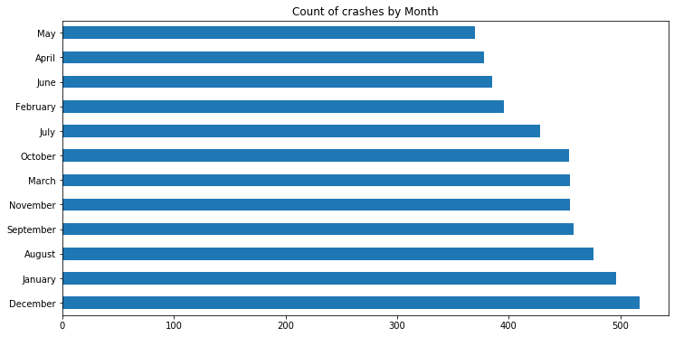


## Count of crashes by Season


```python
date_season = pd.DataFrame()
date_season = pd.Series(data['Date']).dt.month

def get_season(month):
    if month >= 3 and month <= 5:
        return 'spring'
    elif month >= 6 and month <= 8:
        return 'summer'
    elif month >= 9 and month <= 11:
        return 'autumn'
    else:
        return 'winter'

date_season = date_season.apply(get_season)

crashed_by_season = date_season.groupby(date_season).count().sort_values(ascending=False)
crashed_by_season.plot(kind='bar', figsize=[12, 6], title='Count of crashes by Season')
crashed_by_season
```


    Date
    winter    1409
    autumn    1367
    summer    1289
    spring    1203
    Name: Date, dtype: int64


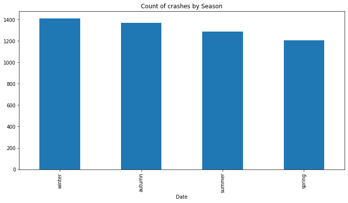


## How many people were on board in each Fatality


```python
pd.Series(
    np.where(data['Aboard'] > 29,'30 and more on board','less than 30 on board')).value_counts(
    normalize = True).plot(kind='bar', figsize=[12, 6], title='How many people were on board in each Fatality')
```


    <matplotlib.axes._subplots.AxesSubplot at 0x7fea98389f90>


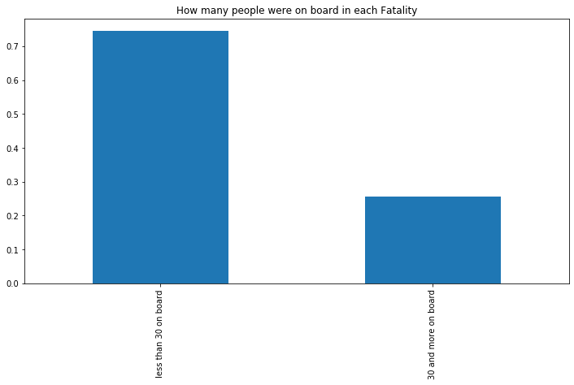


## Count of hijacked planes crashed by year


```python
date_year = pd.DataFrame()
date_year['Year'] = pd.Series(data['Date']).dt.year
date_year['Summary'] = pd.Series(data['Summary'])
date_year[date_year['Summary'].str.contains('hijacke')]['Year'].value_counts().sort_index().plot(
kind='bar',figsize=[12, 6], title='Count of hijacked planes crashed by year')
```


    <matplotlib.axes._subplots.AxesSubplot at 0x7fea983b30d0>


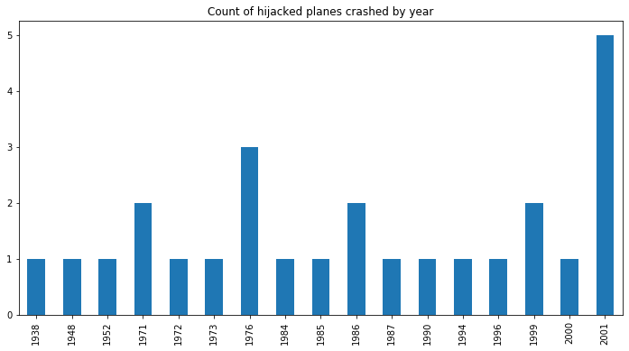


## Count of missing planes by year


```python
date_year['Year'] = pd.Series(data['Date']).dt.year
date_year['Summary'] = pd.Series(data['Summary'])
date_year[date_year['Summary'].str.contains('missing')]['Year'].value_counts().sort_index().plot(
kind='bar',figsize=[12, 6], title='Count of missing planes by year')
```


    <matplotlib.axes._subplots.AxesSubplot at 0x7fea972d2310>


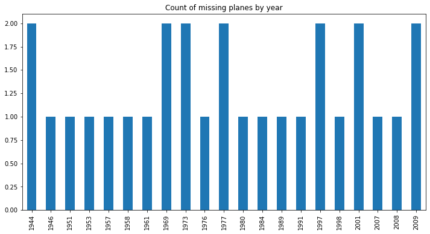


## Analysis of brazilian flights


```python
filter_br = data['Location'].str.contains('Brazil')
data[filter_br]['Operator'].value_counts().sort_index().head(20).plot(
kind='bar',figsize=[12, 6], title='Brazilian plane crash by operator')
```


    <matplotlib.axes._subplots.AxesSubplot at 0x7fea9729b810>


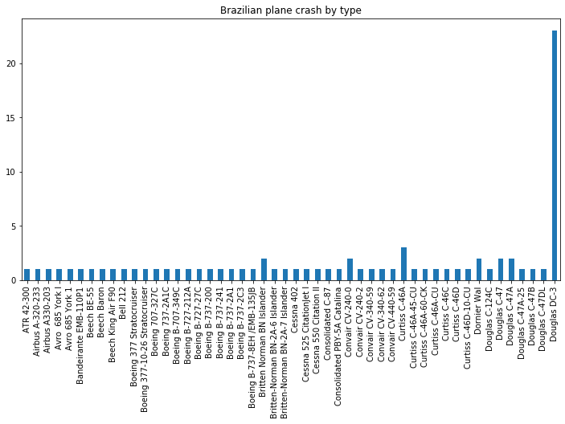


```python
data[filter_br]['Type'].value_counts().sort_index().head(50).plot(
kind='bar',figsize=[12, 6], title='Brazilian plane crash by type')
```


    <matplotlib.axes._subplots.AxesSubplot at 0x7fea971dee50>


## Time series analysis


```python
fig,ax = plt.subplots(3, 2, figsize = (20, 25))

sns.lineplot(x = "Date", y = "Aboard", color = 'g', data = data, ax = ax[0][0])

ax[0][0].tick_params(labelrotation = 15)
sns.lineplot( x = "Date", y = "Ground", color = 'b', data = data, ax = ax[0][1])

ax[0][1].tick_params(labelrotation = 15)
sns.lineplot(x = "Date", y = "Fatalities", color = 'r', data = data, ax = ax[1][0])

ax[1][0].tick_params(labelrotation = 15)
sns.lineplot(x = "Time", y = "Fatalities", color = 'y', data = data, ax = ax[1][1])

ax[1][1].tick_params(labelrotation = 15)
sns.lineplot(x = "Time", y = "Aboard", color = 'g', data = data, ax = ax[2][0])

ax[2][0].tick_params(labelrotation = 15)
sns.lineplot(x = "Time", y = "Ground", color = 'b', data = data, ax = ax[2][1])

plt.show()
```


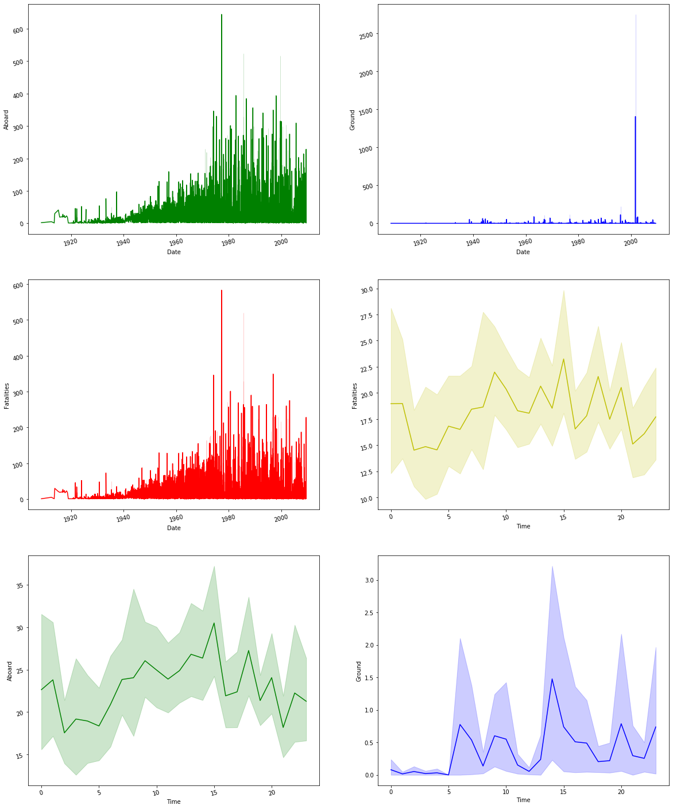


```python
sns.distplot(data['Time'], hist=True, bins=30, rug=True, axlabel="Time")
```


    <matplotlib.axes._subplots.AxesSubplot at 0x7fea96ed7f10>


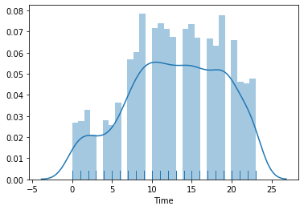


## Plane crashes in WW1 and WWII


```python
select = (date_year['Year'] >= 1914) & (date_year['Year'] <= 1918)
ww1 = pd.DataFrame()
ww1 = date_year[select]
ww1.head()
```


<div>
<style scoped>
    .dataframe tbody tr th:only-of-type {
        vertical-align: middle;
    }

    .dataframe tbody tr th {
        vertical-align: top;
    }

    .dataframe thead th {
        text-align: right;
    }
</style>
<table border="1" class="dataframe">
  <thead>
    <tr style="text-align: right;">
      <th></th>
      <th>Year</th>
      <th>Summary</th>
    </tr>
  </thead>
  <tbody>
    <tr>
      <th>5</th>
      <td>1915</td>
      <td>Crashed into trees while attempting to land af...</td>
    </tr>
    <tr>
      <th>6</th>
      <td>1915</td>
      <td>Exploded and burned near Neuwerk Island,  when...</td>
    </tr>
    <tr>
      <th>7</th>
      <td>1916</td>
      <td>Crashed near the Black Sea, cause unknown.</td>
    </tr>
    <tr>
      <th>8</th>
      <td>1916</td>
      <td>Shot down by British aircraft crashing in flames.</td>
    </tr>
    <tr>
      <th>9</th>
      <td>1916</td>
      <td>Shot down in flames by the British 39th Home D...</td>
    </tr>
  </tbody>
</table>
</div>


```python
select = (date_year['Year'] >= 1939) & (date_year['Year'] <= 1945)
ww2 = pd.DataFrame()
ww2 = date_year[select]
ww2.head()
```


<div>
<style scoped>
    .dataframe tbody tr th:only-of-type {
        vertical-align: middle;
    }

    .dataframe tbody tr th {
        vertical-align: top;
    }

    .dataframe thead th {
        text-align: right;
    }
</style>
<table border="1" class="dataframe">
  <thead>
    <tr style="text-align: right;">
      <th></th>
      <th>Year</th>
      <th>Summary</th>
    </tr>
  </thead>
  <tbody>
    <tr>
      <th>503</th>
      <td>1939</td>
      <td>The aircraft crashed while attempting to land.</td>
    </tr>
    <tr>
      <th>504</th>
      <td>1939</td>
      <td>The aircraft crashed 2,650 feet past the runwa...</td>
    </tr>
    <tr>
      <th>505</th>
      <td>1939</td>
      <td>The seaplane crashed in flames in mountains no...</td>
    </tr>
    <tr>
      <th>506</th>
      <td>1939</td>
      <td>Crashed into the Katherine River during a storm.</td>
    </tr>
    <tr>
      <th>507</th>
      <td>1939</td>
      <td>While en route, the aircraft ditched, broke in...</td>
    </tr>
  </tbody>
</table>
</div>


```python
ww_concat = pd.concat([ww1, ww2])
ww_concat.head()
```


<div>
<style scoped>
    .dataframe tbody tr th:only-of-type {
        vertical-align: middle;
    }

    .dataframe tbody tr th {
        vertical-align: top;
    }

    .dataframe thead th {
        text-align: right;
    }
</style>
<table border="1" class="dataframe">
  <thead>
    <tr style="text-align: right;">
      <th></th>
      <th>Year</th>
      <th>Summary</th>
    </tr>
  </thead>
  <tbody>
    <tr>
      <th>5</th>
      <td>1915</td>
      <td>Crashed into trees while attempting to land af...</td>
    </tr>
    <tr>
      <th>6</th>
      <td>1915</td>
      <td>Exploded and burned near Neuwerk Island,  when...</td>
    </tr>
    <tr>
      <th>7</th>
      <td>1916</td>
      <td>Crashed near the Black Sea, cause unknown.</td>
    </tr>
    <tr>
      <th>8</th>
      <td>1916</td>
      <td>Shot down by British aircraft crashing in flames.</td>
    </tr>
    <tr>
      <th>9</th>
      <td>1916</td>
      <td>Shot down in flames by the British 39th Home D...</td>
    </tr>
  </tbody>
</table>
</div>


```python
sns.distplot(ww_concat['Year'], hist=True, rug=True, axlabel="Plane crashes in WW1 and WWII")
```


    <matplotlib.axes._subplots.AxesSubplot at 0x7fea96161910>


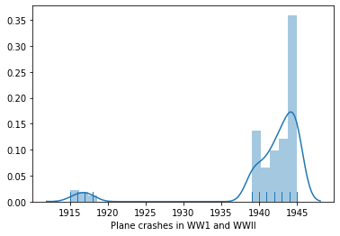


# Granger Causality Test Function


```python
data_causality = pd.DataFrame()
data_causality['Time'] = data['Time']
data_causality['Date'] = date_year['Year']
data_causality['Fatalities'] = data['Fatalities']
data_causality['Aboard'] = data['Aboard']
data_causality['Ground'] = data['Ground']
```


```python
def drop_missing_data_rows_to_causality(data: pd.DataFrame):
    missing_data_rows = pd.isna(data["Date"])|pd.isna(data["Time"])|pd.isna(data["Fatalities"])|pd.isna(data["Ground"])|pd.isna(data["Aboard"])
    return data.drop(data[missing_data_rows].index, axis=0)
```


```python
from statsmodels.tsa.stattools import grangercausalitytests
```


```python
data_causality = drop_missing_data_rows_to_causality(data_causality)
```


```python
def grangers_causation_matrix(data, variables, test='ssr_chi2test', verbose=False, maxlag=5):    
    """
    Check Granger Causality of all possible combinations of the Time series.
    The rows are the response variable, columns are predictors. The values in the table 
    are the P-Values. P-Values lesser than the significance level (0.05), implies 
    the Null Hypothesis that the coefficients of the corresponding past values is 
    zero, that is, the X does not cause Y can be rejected.

    data      : pandas dataframe containing the time series variables
    variables : list containing names of the time series variables.
    """
    df = pd.DataFrame(np.zeros((len(variables), len(variables))), columns=variables, index=variables)
    for c in df.columns:
        for r in df.index:
            test_result = grangercausalitytests(data[[r, c]], maxlag=maxlag, verbose=False)
            p_values = [round(test_result[i+1][0][test][1],4) for i in range(maxlag)]
            if verbose: print(f'Y = {r}, X = {c}, P Values = {p_values}')
            min_p_value = np.min(p_values)
            df.loc[r, c] = min_p_value
    df.columns = [var + '_x' for var in variables]
    df.index = [var + '_y' for var in variables]
    return df
```


```python
grangers = grangers_causation_matrix(data_causality, variables=data_causality.columns)
```


```python
grangers.rename_axis('Predict', axis='columns', inplace=True)
```

> In statistics, statistical significance means that the result that was produced has a reason behind it, it was not produced randomly, or by chance.

Techniques used in the tests:

- Null Hypothesis

> It assumes that the observation is not statistically significant.

- Alpha value

> Alpha value is the level of significance. Example: How close to extremes the data must be for null hypothesis to be rejected. It is usually taken as 0.01, 0.05, or 0.1.

- P value

> P value tells how close to extreme the data actually is. P value and alpha values are compared to establish the statistical significance.If p value <= alpha we reject the null hypothesis and say that the data is statistically significant. otherwise we accept the null hypothesis.


```python
from scipy.stats import describe
describe(grangers)
```


    DescribeResult(nobs=5, minmax=(array([0.0849, 0.    , 0.0423, 0.0052, 0.5126]), array([1., 1., 1., 1., 1.])), mean=array([0.46376, 0.258  , 0.40622, 0.31594, 0.70236]), variance=array([0.17800013, 0.1860063 , 0.1606378 , 0.16246969, 0.03576349]), skewness=array([0.36641674, 1.25253664, 0.64683627, 1.14123704, 0.74017048]), kurtosis=array([-1.65688701, -0.14961533, -1.18192578, -0.22292944, -0.71395171]))


> Assuming a significance level of 0.05, if the p-value is lesser than 0.05, then we do NOT reject the null hypothesis that X does NOT granger cause Y. So, in the below table, the p-value for X=Date and Y=Fatalities is 0.0 and X=Date and Y=Aboard is 0.0. So we reject the null hypothesis and conclude that X (Date) granger causes Y (Fatalities) and  X (Date) granger causes Y (Aboard). That means, Date will likely be helpful in predicting the Fatalities and Aboard.


```python
grangers
```


<div>
<style scoped>
    .dataframe tbody tr th:only-of-type {
        vertical-align: middle;
    }

    .dataframe tbody tr th {
        vertical-align: top;
    }

    .dataframe thead th {
        text-align: right;
    }
</style>
<table border="1" class="dataframe">
  <thead>
    <tr style="text-align: right;">
      <th>Predict</th>
      <th>Time_x</th>
      <th>Date_x</th>
      <th>Fatalities_x</th>
      <th>Aboard_x</th>
      <th>Ground_x</th>
    </tr>
  </thead>
  <tbody>
    <tr>
      <th>Time_y</th>
      <td>1.0000</td>
      <td>0.0131</td>
      <td>0.0423</td>
      <td>0.0348</td>
      <td>0.5126</td>
    </tr>
    <tr>
      <th>Date_y</th>
      <td>0.2980</td>
      <td>1.0000</td>
      <td>0.6350</td>
      <td>0.3022</td>
      <td>0.7537</td>
    </tr>
    <tr>
      <th>Fatalities_y</th>
      <td>0.0849</td>
      <td>0.0000</td>
      <td>1.0000</td>
      <td>0.0052</td>
      <td>0.6624</td>
    </tr>
    <tr>
      <th>Aboard_y</th>
      <td>0.1120</td>
      <td>0.0000</td>
      <td>0.1803</td>
      <td>1.0000</td>
      <td>0.5831</td>
    </tr>
    <tr>
      <th>Ground_y</th>
      <td>0.8239</td>
      <td>0.2769</td>
      <td>0.1735</td>
      <td>0.2375</td>
      <td>1.0000</td>
    </tr>
  </tbody>
</table>
</div>


```python
grangers_pred = pd.DataFrame()
grangers_pred['Date'] = grangers['Date_x']
grangers_pred['Fatalities'] = grangers['Fatalities_x']
grangers_pred['Aboard'] = grangers['Aboard_x']
```


```python
area = plt.figure(figsize=(15,6))

plt1 = area.add_subplot(1,2,1)
plt2 = area.add_subplot(1,2,2)

plt1.scatter(grangers_pred.Aboard, grangers_pred.Date)
plt1.set_title('Date x Aboard')

plt2.scatter(grangers_pred.Fatalities, grangers_pred.Date)
plt2.set_title('Date x Fatalities')
```


    Text(0.5, 1.0, 'Date x Fatalities')


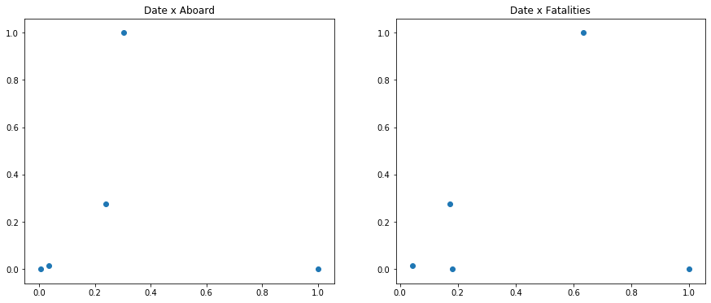


```python
area = plt.figure(figsize=(15,6))

plt1 = area.add_subplot(1,2,1)
plt2 = area.add_subplot(1,2,2)

plt1.scatter(data_causality.Date, data_causality.Aboard)
plt1.set_title('Date x Aboard')

plt2.scatter(data_causality.Date, data_causality.Fatalities)
plt2.set_title('Date x Fatalities')
```


    Text(0.5, 1.0, 'Date x Fatalities')


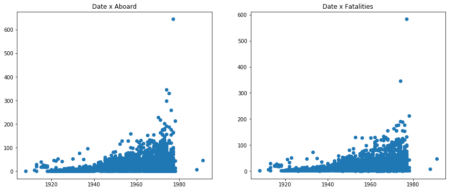


```python
sns.pairplot(grangers)
```


    <seaborn.axisgrid.PairGrid at 0x7fea94492a50>


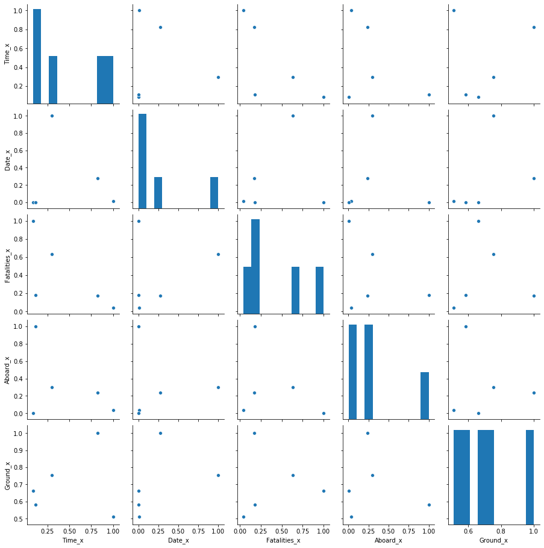


```python
sns.pairplot(data_causality)
```


    <seaborn.axisgrid.PairGrid at 0x7fea8f13bbd0>


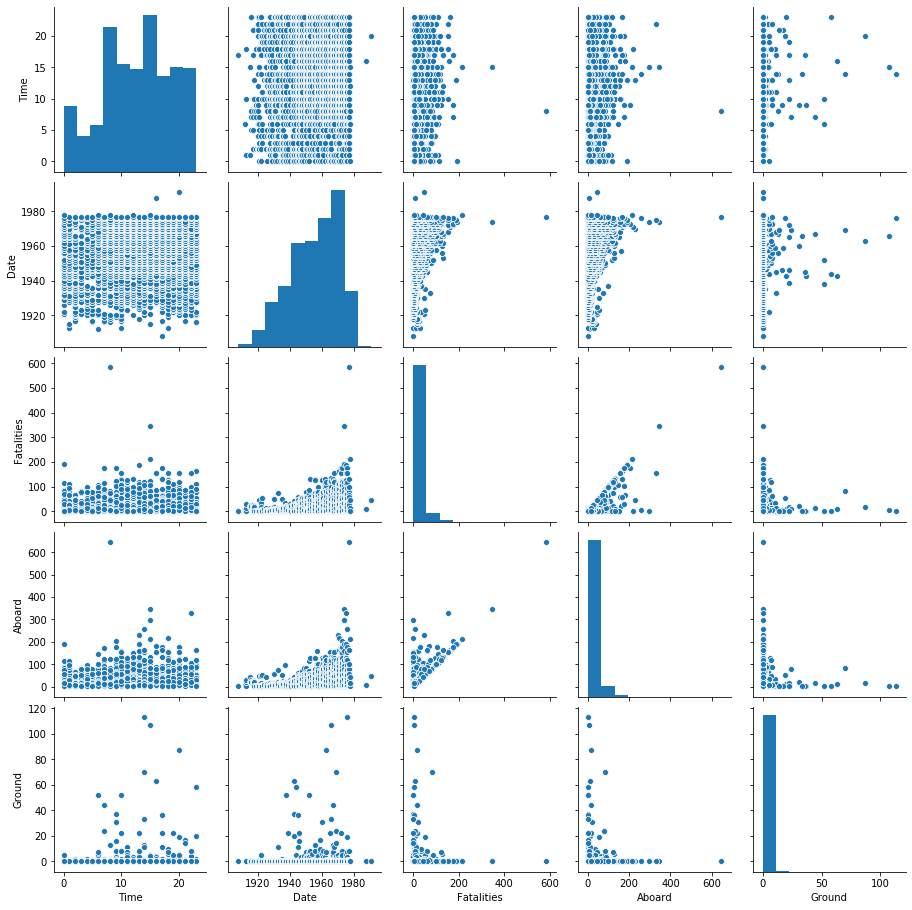


## Network visualization


```python
data_causality_updated = pd.DataFrame()
data_causality_updated['Date'] = data_causality['Date']
data_causality_updated['Aboard'] = data_causality['Aboard']
data_causality_updated['Fatalities'] = data_causality['Fatalities']
```


```python
data_causality_updated = convert_float_to_int(data_causality_updated)
```


```python
import networkx as nx

G = nx.from_pandas_edgelist(data_causality_updated, source='Aboard', target='Fatalities', edge_attr='Date')
```


```python
options = {
    'node_color': '#A0CBE2',
    'edge_color': 'BB0000',
    'font_color': 'red',
    'node_size': 100,
    'width': 2,
    'arrowstyle': '-|>',
    'arrowsize': 5,
    'font_size':8
}
```


```python
plt.figure(3, figsize=(30,30), dpi=300)
pos = nx.draw_kamada_kawai(G)
nx.draw(G, pos, edge_cmap=plt.cm.Blues, with_labels=True, **options)
plt.savefig("graph_aboard_fatalities_date.pdf")
```


```python
G = nx.from_pandas_edgelist(data_causality_updated, source='Date', target='Fatalities', edge_attr='Aboard')
```


```python
plt.figure(3, figsize=(30,30), dpi=300)
pos = nx.draw_kamada_kawai(G)
nx.draw(G, pos, edge_cmap=plt.cm.Blues, with_labels=True, **options)
plt.savefig("graph_date_fatalities_aboard.pdf")
```


```python
G = nx.from_pandas_edgelist(data_causality_updated, source='Fatalities', target='Aboard', edge_attr='Date')
```


```python
plt.figure(3, figsize=(30,30), dpi=300)
pos = nx.draw_kamada_kawai(G)
nx.draw(G, pos, edge_cmap=plt.cm.Blues, with_labels=True, **options)
plt.savefig("graph_fatalities_aboard_date.pdf")
```


## Time Series visualization


```python
data_causality_updated.plot(kind='line')
```


    <matplotlib.axes._subplots.AxesSubplot at 0x7fea85810450>


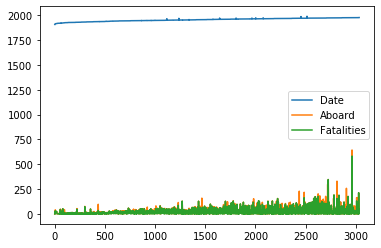


```python
data_causality_updated_samples = data_causality_updated.sample(n=30, random_state=1)

plt.figure(figsize=(12,6))
sns.scatterplot(
    data=data_causality_updated_samples, x="Aboard", y="Fatalities", hue="Date",
    sizes=(20, 800), legend="full"
)
```


    <matplotlib.axes._subplots.AxesSubplot at 0x7fea7458f550>


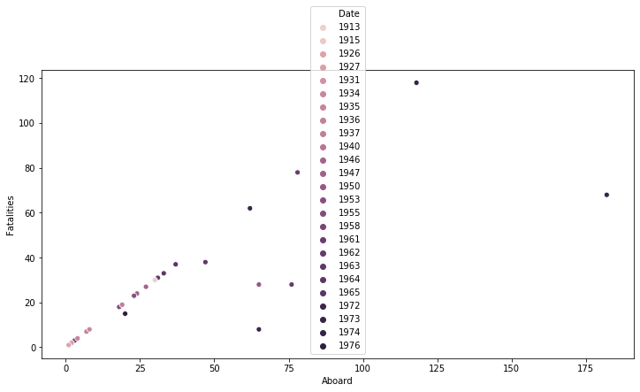

